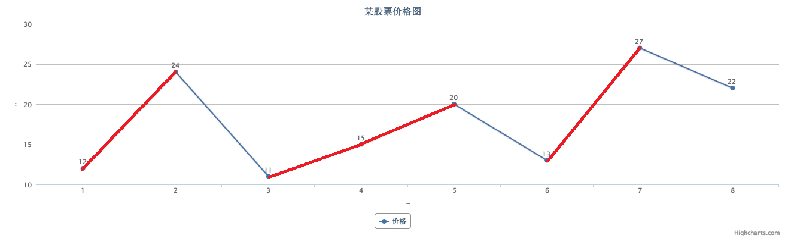

# 122 Best Time to Buy and Sell Stock II

## Question:

Say you have an array for which the ith element is the price of a given stock on day i.

Design an algorithm to find the maximum profit. You may complete as many transactions as you like (ie, buy one and sell one share of the stock multiple times). However, you may not engage in multiple transactions at the same time (ie, you must sell the stock before you buy again).

给出某支股票未来几天的价格数组，希望你设计一个算法来算出最大的收益。

你可以随意买卖股票，但是不能同时多次买入或卖出股票，也就是说，你在买股票之前，必须卖出手中已有的股票。

## Solution:

假设如图是价格曲线，只要在价格线上升阶段持有股票就能收益，最大收益即所有上升高度之和。



对算法来说就是，如果数组中第i个元素比第i-1个元素大，就可以获得收益。

## AC Code:

``` c++
class Solution {
public:
    int maxProfit(vector<int>& prices) {
        int ret = 0;
        for(int i = 1; i < prices.size(); ++i) ret += max(prices[i] - prices[i-1], 0);
        return ret;
    }
};
```
